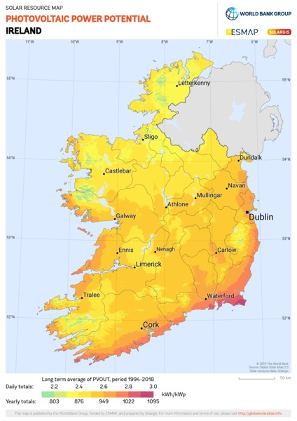

# Milestone Project 2. Solanew PV Systems

This project is based on a solar panel installation coming based in Ireland. The name of the website is Solanew PV systems which is a ficticious company I made up. I made this website as I come from an electrical background and I am very interested in solar energy and it's benefits to the environment and the users independence from rising utility costs. 
The main aim of this website is to ultimately sell the supply and installation of bespoke designed solar photovoltaic systems to home owners across Ireland. I spent some time researching the annual solar radiation figures for all counties in Ireland and I also researched the efficiency of the leading solar panel brands. I turned this data into a very usefull tool for customers to see what annual savings they can make by installing solar energy. The data is based on accurate figures and gives accurate results that could also be used by other solar panel installation companies. I hope to develop this idea more in depth for an onsite app in future. 
The site layout is to be clean and simple with the use of hero images for each section and a clearly defined call to action to guide the user through a business funnel and ultimately to a conversion. 

# UX

## UX Mockups
The website is made up of 4 clearly defined sections:
1. Home section
2. Services section
3. Solar Savings Calculator section
4. Contact Form section
The design will be simple and minimal relying on a blend of white backgrounds with black text and also a blend of orange and red icons and dividers to convey a solar theme. The use of emotive hero images of renewable energy will tie all the sections together. 

My main themes for user interactivity will be the use of JQuery to show and hide content with read more buttons. The use of drop down accordian info boxes. The use of Emal JS for my contact form. And my main interactive element will be the solar savings calculator designed by me and based on real world data that returns accurate figures for every county in Ireland.
The use of a fixed navigation bar that changes color on scrolling will also add to interactivity.

The following links shows the mockups designed with Balsamique wireframes:
* [Home](assets/wireframes/wireframe-home.png)
* [Services](assets/wireframes/wireframe-services.png)
* [Solar-Calculator](assets/wireframes/wireframe-savings.png)
* [Contact](assets/wireframes/wireframe-contact.png)

# User Stories:
1. **As a Home owner I am interested in lowering my utility bills and I would like to know more about solar energy for my home.**

2. **As a business owner I am interested in lowering my company costs as well as my carbon taxes**

3. **As a new company I am interested in my company being modern and helpful to the environment. I want to lower our carbon emmisions and market our company as modern and environmentally friendly. I am very interest to add a solar panel carport for our employees which will shelter their charge their electric vehicles.**
