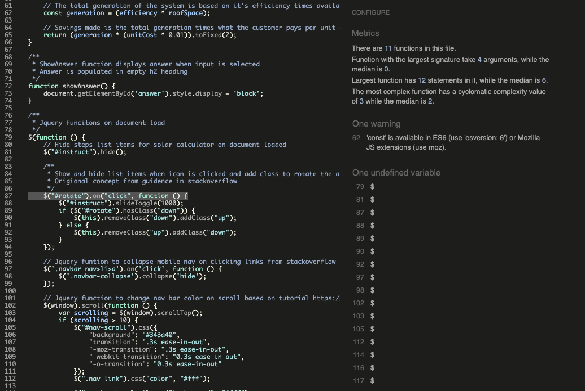
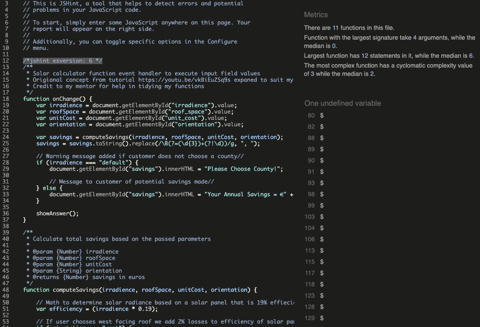

# Milestone Project 2. Solanew PV Systems

This project is based on a solar panel installation coming based in Ireland. The name of the website is Solanew PV systems which is a ficticious company I made up. I made this website as I come from an electrical background and I am very interested in solar energy and it's benefits to the environment and the users independence from rising utility costs. 
The main aim of this website is to ultimately sell the supply and installation of bespoke designed solar photovoltaic systems to home owners across Ireland. I spent some time researching the annual solar radiation figures for all counties in Ireland and I also researched the efficiency of the leading solar panel brands. I turned this data into a very usefull tool for customers to see what annual savings they can make by installing solar energy. The data is based on accurate figures and gives accurate results that could also be used by other solar panel installation companies. I hope to develop this idea more in depth for an onsite app in future. 
The site layout is to be clean and simple with the use of hero images for each section and a clearly defined call to action to guide the user through a business funnel and ultimately to a conversion. 

## [View Live Project](https://joe2308.github.io/milestone-2-solanew-pv-systems/)

# UX

## UX Mockups
The website is made up of 4 clearly defined sections:
1. Home section
2. Services section
3. Solar Savings Calculator section
4. Contact Form section

The design will be simple and minimal relying on a blend of white backgrounds with black text and also a blend of orange and red icons and dividers to convey a solar theme. The use of emotive hero images of renewable energy will tie all the sections together. 

My main themes for user interactivity will be the use of JQuery to show and hide content with read more buttons. The use of drop down accordian info boxes. The use of Email JS for my contact form. And my main interactive element will be the solar savings calculator designed by me and based on real world data that returns accurate figures for every county in Ireland.
The use of a fixed navigation bar that changes color on scrolling will also add to interactivity.

The following links shows the origional concept mockups designed with Balsamique wireframes:
* [Home](assets/wireframes/wireframe-home.png)
* [Services](assets/wireframes/wireframe-services.png)
* [Solar-Calculator](assets/wireframes/wireframe-savings.png)
* [Contact](assets/wireframes/wireframe-contact.png)

As my UX ideas evolved I ended up with a slightly different design and features. The final wireframe design can be seen here:
* [Final Wireframe](assets/wireframes/revised-wireframe.png)

# User Stories:
1. **As a Home owner I am interested in lowering my utility bills and I would like to know more about solar energy for my home.**

2. **As a business owner I am interested in lowering my company costs as well as my carbon taxes**

3. **As a new company I am interested in my company being modern and helpful to the environment. I want to lower our carbon emmisions and market our company as modern and environmentally friendly. I am very interested to add a solar panel carport for our employees which will shelter and charge their electric vehicles.**

4. **As a quantity surveyor for a large construction company I need information and pricing for the installation of solar panels on a large residential estate of 100 semi detached dwellings.**

## Strategy:
### What am I making?
A website that offers knowledge to potential solar panel customers in the guise of easy to understand text points and interactivity in the form of an extremely user-friendly solar savings calculator. The calculator is easy to use and once a customer realises the savings on offer it will entice them to reach out for a price for solar panels their home or business.  

### Website business goals:
1. Enlighten visitors on the benefits of solar energy 
1. Get visitors to interact with the solar savings calculator. 
1. Entice a call to action in form of an enquiry. From here we should have a very high conversion rate as our sales team will explain how an initial investment in solar panels can earn customers money and savings over decades of flawless operation.

### Website target audience:
1. Private home owners
1. Architects and Quantity surveyors
1. Business owners commercial and industrial

### User value:
This website will enlighten potential customers on the operation of solar energy will also allowing them to obtain annual savings estimation based on real world data.

### What users can expect:
1. An easy to navigate no fuss website that is pleasant to use.
1. Easy to contact the sales team via a user-friendly contact form and call to actions.
1. Informative information that will clear up any misgivings about solar energy in Ireland.
1. A savings calculator to gives results based on data input by the user.

### What is worth doing:
1. High quality images in colorfull animation style to entice users to use a friendly company with great customer support. 
1. A contact form for more sales leads. 
1. Use of call to action buttons to guide the user towards a conversion.
1. A user-friendly solar savings calculator.
1. Show and hide large pieces of text with Jquery.

### Single use learning:
I made this website easy to navigate and intuitive for first time users.
The content is laid out to allow for the least possible steps to a conversion booking. 

### What makes it a good experience:
1. Simple outlay. 
1. Emotive images.
1. Interactive savings calculator.
1. Lots of great information on solar panels in easy to understand language. 
1. Simple navigation.
1. Easy to contact the sales team.

### Where would a user go first and why?
Users will most certainly be interested in how much they can save on their energy bills. They will begin by using the solar savings calculator first. From here they will enquire about pricing for a custom system for their premises.

### How do I initiate an impulse buy/booking?
Feel good content with CTA flow to lead to completing the contact and follow the company on social media.

## Scope:

### Features for this release:
1. Solar savings calculator.
1. Contact form.
1. Emotive images. 
1. Rich informative content on the how solar panels work.
1. Call to action buttons based on information hierarchy.
1. Social media links.

### User requirements:
1. The ability to learn about solar energy.
1. The ability to calculate exactly how much they can save by installing solar energy.
1. The ability to contact the sales team.
1. The ability to read rich content.
1. The ability to follow the company on social media. 
1. The ability to view images.

### How we will achieve these requirements:
1. By adding easy to read no jargon text.
1. By adding an intuitive savings calculator that takes user input.
1. By implementing a contact form.
1. Good headings and paragraphs that are informative and enjoyable to read.
1. Appropriate social links in the footer and also by use of natural internal links in the content.
1. Each page will have a hero image and also each section on each page will begin with an image.

## Structure:

### Navigation
I have implemented a single page site of 4 sectons:
1. Home
1. Services
1. Savings Calculator
1. Contact Us
1. The header also contains the band logo which has a return to home link.

I have used a fixed navigation bar to allow users to move to any other section from their current section. I have also used Jquery to add a back to top button and change the color of the navigation on scrolling. 
This creates a better user experience and avoids excessive scrolling. I have also implemented the use of embedding text links throughout sections of content that relates to other important content internally and externally such as instructional videos and the company's social media platforms.
The linking stucture keeps my user experience strategy in mind of generating conversions through contact form enquiries and social media followers.

## Skeleton:

### Presentation
1. Simple layout.
1. Hero image for each section.
1. Fixed navigation.
1. Consistent layout and theme.

### User conventional tools:
1. Clear headings. 
1. Clickable elements clearly labelled. 
1. Easy to read nav bar. 
1. Social media links in the form of clickable icons in the footer. 

### Progressive disclosure:
I have placed the priority content on the home page so the user sees this first.
I have arranged the supporting content in order of priority in additional sections. 
Each section links to the most important items to engage users and encourage a conversion.

### Elements that have priority:
1. Navigation menu with fixed scrolling.
1. Clickable logo with return to home link.
1. Solar savings calculator and hero images. 
1. Social media links.
1. Contact form.

## Surface

### Colors:
I have gone form a simple theme of a clean white background for the body with orange color h1 heading And call to action buttons. My lower level headings are black with orange icons and dividers. I choose the color orange and white to convey energy from the sun over a clean landscape.

### Fonts:
- For the headings I have chosen Montserrat in black as it is simple effective and professional.
- For the main text I have decided to stick with Montserrat but I have used a grey color on my paragraphs. I just liked how this looked and felt I did not need a different font style for the text.
### Images: 
Deciding to invest in solar panels can be a daunting experience for home owners. Add to this the fact there are many similar companies offering the best service. To stand out I decided to add some fun to the website by using cartoon style images. They are very welcoming to visitors and still convey exactly what the company is all about. Professional friendly service with outstanding customer support.
All images have been taken from google images. I made sure to check all images were free to use and share so there would be no copyright infringments. To this I search for google images clicked on settings >> advanced search and made sure the setting for usage rights was enabled.

### Order and sequence:
1. Navigation order - Home/ Services/ Solar Savings Calculator/ Contact US.
1. Home section order - Hero image/ Heading/ Call to action/ Intro paragraph and image/ How it works bootstrap cards.
1. Services section order - Heading/  Call to action/ Hero image/ Paragraph of text and image.
1. Solar Savings Calculator section - Heading/ Instructional steps/ Calculator on opaque background image.
1. Contact Us section order - Heading/ Contact form/ Submit button.
1. Footer section order - Company name/ social links/ copyright.

### Other themes:
1. Use of relevant font awesome icons to add a professional touch.
1. Use of subtle shadows to lift some elements off the page.

# AVAILABLE FEATURES

### Navbar
The nav bar is fixed to enhance user experience. All navigation links change color on clicking. I have also added bootstrap scroll spy and the navigation links change color as the user scrolls through each section. I have made use of Jquery to change the color of the Navigation bar on scrolling. I have also used Jquery to add a back to top button that fades in as the user scrolls down and fades out as the user returns to home.

### Home
The home page is laid out with a friendly animated hero image. The company name and a call to action slide in from the left and right using keyframes animation. From research the first thing customers want to know about solar panels is how much they can save on energy bills by installing them. The main standout point on the home page for this reason is a call to action button that links to the solar savings calculator. Below the CTA button I have used bootstrap's grid to display two columns on larger devices of an image and a simple explainer paragraph. The first two sentences are displayed and I have use Jquery to target a read more button to show extra text. Below that I have used bootstrap cards to display the professional qualities of the company.

### Services
The services page contains a call to action button that links to the contact form. By this stage the user should have received enough positive information to encourage them to make contact for design and pricing. On larger devices I have used an explainer gif as the hero image. This shows how energy is generated from daylight negating the need to import from the grid while also storing surplus energy which can then be used at night time and topped up by the grid. This is an engaging image which is certain to not only draw a positive reaction from visitors but also increase session duration which can be of help in search engine rankings. Below this there is also another image with a paragraph of text. I have also used Jquery to target a read more button here to show hidden text.

### Solar Savings Calculator
The introduction to the savings calculator is instruction steps on how to use it effectively. I have used a Jquery accordian to allow the steps to drop down after clicking on the arrow.
The calculator itself has been written in vanilla Javascript. It is based on real world data. I researched the annual sunshine hours generated per county in Ireland per square meter. I based calculations on solar panels that are 19% efficient at peak power. When the user selects a county an onChange funciton is triggered that multiplies the irradience value of the selected county by the efficiency of the panel. The user then selects an average area of free roof space and this input value is multiplied by our irradience times efficiency result. The result of this is then multiplied by the cost the user inputs that they currently pay per unit of electricity. The savings result is then display in the inner HTML of a h2 heading. There is also the option to select different roof orientations. If the user does so an if else state also for a lower effieciency to be used to allow for losses. An additional if else statement is used for user error. If the user does not select a county and proceeds to input the other form fields an message is displayed, "Please choose county".
The values for the calculator were taken from this irradience data for Ireland:

### Contact US 
At this point the user should be fully satisfied they have been fully informed in a transparent way about the workings of solar panels and how they are certainly a great investment. This is why the contact form has been left quite simple to entice a conversion. Once the user has come this far the sales team will complete the funnel. The emails are being send by email.Js.
 

### Footer
I have added social media links and contact details in the footer. All social media icons are clickable and work in external tabs.
I also added copyright details in a seperate bootstrap collumn. 

### Features to add for future releases:
There are some features that I would love to implement on future releases:

1. #### Desing your own system for customers - Allow the user to build there own solar panel system in a step through process using Javascript. The user can select the number of panels the type of frame and controls would then be selected for them based on number of panels. The final step would then give users a price to supply and fit while also giving accurated system genertaion details.
1. #### Live chat - This would be a great support option to engage with new users and reduce bounce rate and increase session times.
1. #### Installers support section and downloadable app - Future versions would certainly have the option to support installation experts making them potential customers also. On site survey calculators and orientation tools to make installers lives easier would drive excellent traffic to the site.
1. #### Ecommerce - There is a great opportunity to add some extras for people who already have solar panels installed. Affordable monitoring solutions and wifi sticks could be added to a store section as well as tools such as wire cutters and survey equipment for installers.

# TECHNOLOGIES USED

1. [Balsamiq](https://balsamiq.com/wireframes/)
* I found Balsamiq an extremely usefull platform to design mock ups and get a feel of how my website would look before coding.

2. [HTML 5](https://en.wikipedia.org/wiki/HTML)
* HTML is the main mark up language used to design my webiste.

3. [CSS 3](https://en.wikipedia.org/wiki/CSS)
* All HTML elements were styled to my own personal taste using CSS language.

1. [Javascript](https://www.javascript.com/)
* The solar savings calculator was designed used vanilla Javascript.

1. [Jquery](https://jquery.com/)
* Jquery was used to show and hide elements on the document.

1. [EmailJS](https://www.emailjs.com/)
* EmailJS was used to send my contact form.

4. [Bootstrap 4](https://getbootstrap.com/docs/4.5/getting-started/introduction/)
* In order to make my website responsive I used the bootstrap 4 grid system. I also used bootstrap for the responsive image cards.

5. [Font Awesome](https://fontawesome.com/)
* All icons have been sourced and added from the free version of font awesome.

6. [Google Fonts](https://fonts.google.com/)
* I used google fonts to source Monserrat to style all of my headings and text.

7. [Gitpod](https://www.gitpod.io/)
* I used git pod as my IDE workspace to write and run all code. I used Git as my version control to commit and push all code to my GitHub repository.

8. [Github](https://github.com/)
* I used GitHub to store my Git commits and back up all code.

9. [W3C HTML validator](https://validator.w3.org/)
* I used the W3C validation service to ensure all HTML code passed validation.

10. [W3C CSS validator](https://jigsaw.w3.org/css-validator/)
* I used the W3C validation service to ensure all CSS code passed validation.

11. [Photoshop](https://www.adobe.com/ie/products/photoshop.html)
* I used Adobe photoshop to create the company logo and favicon.

13. [Optimizilla](https://imagecompressor.com/)
* When testing load speeds in Lighthouse some of my images needed to be optimized. Optimizilla allowed me to compress images up to 80% dramatically improving the website's performance in Lighthouse.

14. [Chrome Developer Tools](https://developers.google.com/web/tools/chrome-devtools)
* Throughout the development process I used chrome developer tools for debugging and also to keep checking any changes I was making looked good on all devices.

15. [WAVE web accessibility tool](https://wave.webaim.org/)
* I used WAVE to make check any errors that my site may have which would effect users with hearing or visual disabilities.

16. [a11y](https://color.a11y.com/)
* I used a11y to get my color contrast between background and text as accessible as possible without comprimising my vision for the website design.

17. [CSS Autoprefixer](https://autoprefixer.github.io/)
* I used Autoprefixer to ensure all of my css styles would work on all browsers.

# TESTING STEPS

## User story testing:

1. **As a home owner** I have found the cost of my electricity has begun to rise. On performing a google search I am presented with the welcoming and informative SolaNew PV Systems.
I find technology and electriconics intimidating and I Just want to know if solar panels will be a good investment. 
On entering the website I am presented with an eye catching image and a button below that says try our solar savings calculator. The calculator is easy to use and it tells me exactly how much I can save. This has encourage me to get in touch through the companies contact form and begin my renewable energy journey.

1. **As a business owner** I am interested in lowering my overheads as well as lower my carbon footprint. I find the website is very easy to navigate and the information is very informative and jargon free. The use of text hidden with read more buttons allowed me not be overwhelmed with information on my first visit. The navigation menu followed me to each section and it was very easy to find the information that I needed. The addition of a google maps location allowed me to visit the showroom directly for a full demo.

1. **As a new company** I want to market to our client and employees that we are a modern company playing our part in the environment. We are interested in installing electric car chargers for our employees and would like these chargers to powered by solar energy. The webiste offered me information and I was swiftly guided along through each section feeling I knew a bit more about solar energy. I was compelled to fill out the contact form where I was presented with a success message. A member of the sales team was very quick to reply and take my order.

1. **As a quantity surveyor** I am given the task of pricing for solar panels on a large social housing scheme. SolaNew PV System's website caught my eye. The solar energy calculator is a great touch that allowed me to get direct information on savings for my project with the need of a science degree! I was able to include this data in a monthly pricing and progress report for my employer. My employer gave the green light to offer the installation project to SolaNew PV systems.

## Manual Testing:

#### Scroll to top button: 
I made sure to check that this was working correctly on all devices. I origionally had a problem where the button was travelling behind images, to correct this I used z-index in css. I also had an issue where you could see the button on window load for a split second before it was hidden. I figured out the reason for this was I ass using a jquery css selector to hide the icon and my Jquery was loading last. To solve the issue I just set the icon to display none in my style.css. I could also have moved my Jquery script to be called in the head of the page but I did not want to effect the page load speed.

#### Navbar background change color on scroll: 
I made sure to test this on all screen sizes and I noticed I was having some issues but quickly found that I needed to override my bootstrap default css for all of my Jquery to work correctly.

#### Responsive design:
* I carried out exstensive user testing and consistently checked links and screen sizes on all available devices in Chrome dev tools.
* The desktop design utilizes two and three columns in some sections, where responsive devices use one single column. I used bootstrap's grid system to achieve this.
* I changed one image for smaller screen sizes up to 540px as I felt it was a better fit.
* I applied appropriate media queries for all screen sizes to ensure all of my images looked consistent across all devices.

#### Call to action buttons:
* I checked and rechecked all buttons were working on all devices and were leading to the correct sections of the website. It was also important that I laid out 
my CTA choices in order of priorty to my user stories with a button to find the solar calculator and a button for the contact form being the most important.

#### Contact form:
I kept my contact form simple with a background color that complemented the theme, this also meant it translated well on all device types. I also used EmailJS to send my form as learned in Code Institute's Javascript modules. A final feature I added was the use of a bootstrap success alert to display only when the required fields were sent. I used an if else statement with JQuery to achieve this based on whether each field was empty or not. I also added an automatic timeout for the success alert.

#### External links:
I made sure to check that all links and social media links were directed to the correct URLS and also that my target="_blank" attribute was working. 
All external links open in a new browser tab.

#### Read More Read Less Buttons: 
I used Jquery to show and hide text with Read More Read Less buttons by adding an event listener. Based on which element was showing I used an if else statement to change the css propertys of the button and the inner HTML. I used the dev tools console to make sure no errors were present and I manually checked the operation of the buttons. Origionally I had used the same class to target each read more section but found that I needed to use seperate classes so each section would behave independantly.

#### Solar Calculator Instructions: 
I used Jquery to show and hide list item intructions on how to use the solar calculator. I used Jquery to add an event listener to run a function containing an if else statement that added and removed classes based on which class was present. I then used css to rotate the arrow 180 degrees and show and hide the list items. This particular task took some research as I origionally tried using Jquery to change background images off directional arrows but eventually settled on using css to rotate a font awesome icon. 

#### Solar Calculator
The solar calculator was the origional concept for this project and I began working on that well in advance in a seperate gitpod workstation to make sure I could make it work. It can be seen from my [github repo](https://github.com/Joe2308/solar-calculator-practise) The basic design was based on a youtube tutorial for monthly loan repayments. I used the console and jshint.com to make sure there were no issues with my Javascript. It took some figuring out on paper. 
 
I made sure to check the console in dev tools during the coding process to make sure there were no errors. I also ran my code through jshint.com. 

## HTML and CSS validation and fixes:
1. I used [W3C CSS validation service](https://jigsaw.w3.org/css-validator/) to test and check my CSS code. I luckily had no issues to find and fix. 

2. I used [W3C HTML validation service](https://validator.w3.org/) to test and check my HTML code. There were some errors. I had an error that type and text tages were not necessary when adding script links. I removed these and retested. I had an error for an empty h3 tag. I did not fix this as I am using Javascript to populated this heading with an onChange event.

3. I used [JS Hint validation service](https://jshint.com/) to test all of my Javascript files. I had one warning in my main.js file saying that the const is availble in version ES6. To remedy this I placed a comment /*jshint esversion: 6 */ at the top of the file and restested. I passed with no major issues. 

